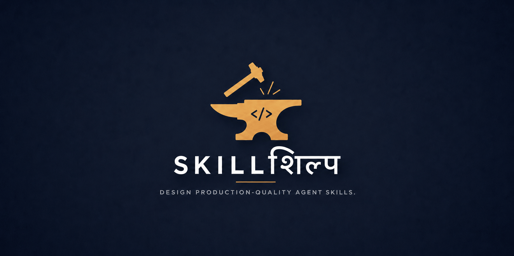

<p align="center">
  
</p>

<h1 align="center">SKILLशिल्प (SKILLSHILP)</h1>

<p align="center">
Build Better Agent Skills.
</p>

<p align="center">
  
  
  
</p>

**Skillshilp** is an open-source collection of meta-skills for creating, reviewing, and maintaining production-quality Agent Skills that follow the official [Agent Skills specification](https://agentskills.io).

Rather than simply generating `SKILL.md` files, skillshilp applies proven software engineering principles—such as modularity, progressive disclosure, single responsibility, maintainability, and token efficiency—to help produce skills that remain easy to understand, evolve, and reuse.

## Features

* 🏗️ Design production-quality Agent Skills from ideas, prompts, and specifications
* 🛠️ Review and refactor existing Agent Skills while preserving their intent
* 📦 Encourage modular architecture and progressive disclosure
* 🔍 Detect common design issues and architectural anti-patterns
* 📚 Include concise reference material for validation and best practices
* 🧪 Provide lightweight portable Bash validation for basic skill structure
* ⚡ Optimized for low token usage without sacrificing capability

## Included Skills

### 1. `skillshilp-create`

> Designs new production-quality Agent Skills from ideas, requirements, reusable prompts, or specifications. It's architectural and generative: it designs new skills and collections from first principles.

### 2. `skillshilp-edit`

> Reviews, refactors, and improves existing Agent Skills while preserving their intended behaviour and architecture. It's incremental and conservative: it evolves existing skills while preserving their contracts.

## Installation

### npx skills

```bash
npx skills@latest add ViGi-P/skillshilp
```

### GitHub Skills

```bash
gh skill install ViGi-P/skillshilp
```

## When to Use

Use **skillshilp-create** when you want to:

* create a new Agent Skill
* convert a reusable prompt into a skill
* design a modular skill collection
* architect a new skill from requirements

Use **skillshilp-edit** when you want to:

* improve an existing skill
* refactor skill architecture
* modernize documentation
* simplify prompts
* review a skill against current best practices

## Repository Structure

```text
skillshilp/
└── skills/
    ├── skillshilp-create/
    │   ├── SKILL.md
    │   ├── README.md
    │   ├── scripts/
    │   │   └── validate-skill.sh
    │   └── references/
    │       ├── constraints.md
    │       ├── patterns.md
    │       └── skill-smells.md
    │
    └── skillshilp-edit/
        ├── SKILL.md
        ├── README.md
        ├── scripts/
        │   └── validate-skill.sh
        └── references/
            ├── constraints.md
            ├── patterns.md
            └── skill-smells.md
```

## Philosophy

Every Agent Skill should strive to be:

* Reusable
* Discoverable
* Modular
* Composable
* Maintainable
* Deterministic
* Token-efficient

skillshilp is built around these principles and treats Agent Skills as software components rather than one-off prompts.

## Contributing

Discussions, issues, suggestions, and pull requests are welcome.

If you discover opportunities to improve skill architecture, progressive disclosure, maintainability, or token efficiency, please open an issue or submit a pull request.
